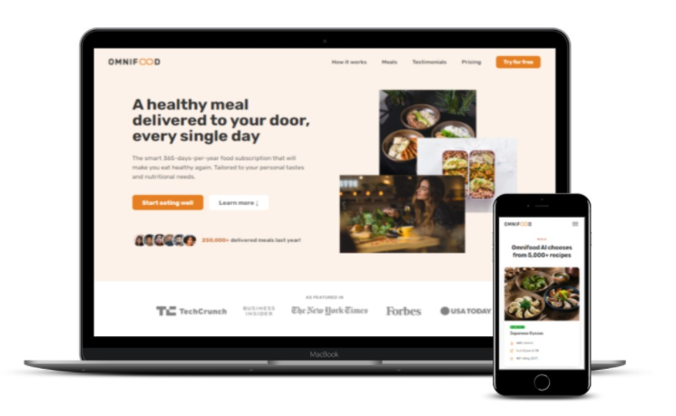

<<<<<<< HEAD
# Omnifood

A modern responsive food delivery website built with HTML, CSS, and a touch of JavaScript.

## 🚀 Features

- Responsive layout for mobile, tablet, and desktop
- Reusable components and sections
- Clean, modern UI
- Semantic HTML and BEM methodology
- Hosted using GitHub Pages

## 🛠️ Technologies Used

- HTML5
- CSS3 (Flexbox, Grid)
- JavaScript (basic interactivity)

## 📸 Live Demo

[🔗 View the live site](https://hamza-elboudrary.github.io/Omnifood-Project/)

=======
# Omnifood-Project
>>>>>>> 62435009d0f72bffe8a7e0a9d22d4809ef7baf45
